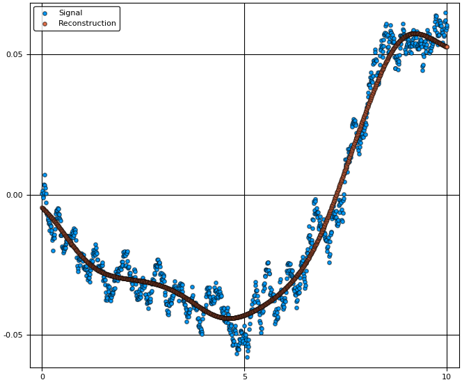
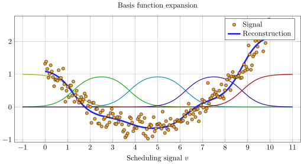

# BasisFunctionExpansions

[](https://travis-ci.org/baggepinnen/BasisFunctionExpansions.jl)

A Julia toolbox for approximation of functions using basis function expansions (BFEs).

BFEs are useful when one wants to estimate an arbitrary/unknown/complicated functional relationship between (in the simple case) two variables, `y` and `v`. In simple linear regression, we might consider a functional relationship `y = ϕ(v) = αv + β`, with parameters `α` and `β`. However, if the function `ϕ` has an arbitrary nonlinar form, it might be hard to come up with suitable basis functions to use for linear regression. This package provides a set of convenient methods to estimate `ϕ(v)` as a linear combination of basis functions, such as radial basis functions, for situations where `v` has a single or multiple dimensions.

Currently supported basis functions are
* Uniform Radial Basis Functions (Gaussian with diagonal covariance matrix) `UniformRBFE, MultiUniformRBFE`


# Usage
We demonstrate typical usage with some examples.

The idea is to create an object representing an expansion. This object contains information regarding the domain of the expansion, which type of basis functions used and how many. These objects are, once created, callable with a scheduling vector/matrix. A call like this returns a vector/matrix of basis function activations.

To reconstruct a signal, a linear combination of basis functions must be estimated. To facilitate this, a second type of objects are available: `BasisFunctionApproximation`. Once created, `BasisFunctionApproximation`s are callable with a scheduling signal and return a reconstruction thereof. The parameter estimation is performed behind the scene using standard linear regression (least-squares). An optional regularization parameter can be supplied if needed, see `?BasisFunctionApproximation` for help.

Plotting functionality requires `Plots.jl`

## Single dimension
We start by simulating a signal `y` and a scheduling signal `v`. The task is to estimate a function `y = ϕ(v)`, where `ϕ` is a basis function expansion.
```julia
N = 1000
v = linspace(0,10,N) # Scheduling signal
y = randn(N) # Signal to be approximated
y = filt(ones(500)/500,[1],y)
```

Next, we setup the basis function expansion object `rbf` and use it to create a reconstruction object `bfa`
```julia
Nv  = 10 # Number of basis functions
rbf = UniformRBFE(v,Nv, normalize=true) # Approximate using radial basis functions with constant width
bfa = BasisFunctionApproximation(y,v,rbf,1) # Create approximation object
ŷ   = bfa(v) # Reconstruct signal using approximation object
scatter(v,y, lab="Signal")
scatter!(v,ŷ, lab="Reconstruction")
```

For comparison, we can also plot the regular linear regression `y = α₀ + α₁x + α₂x²... αₙxⁿ` for varying orders of `n`.

```julia
A = v.^(0:3)'
ŷ_linreg = [A[:,1:i]*(A[:,1:i]\y) for i=2:4]
plot!(v,hcat(ŷ_linreg...), lab=["Linear regression order $i" for i=1:3]')
```


As we can see from the figure, the linear combination of basis functions forming the reconstruction has learnt the overall structure of the signal `y`. To capture more detail, one can try to increase the number of basis functions. The final choice of this number is a tradeoff between reconstruction bias and variance, where a high number of basis functions can model the signal in great detail, but may generalize poorly to unseen data.


## Multiple dimensions
We now demonstrate the same thing but with `v ∈ ℜ²`. To create a nice plot, we let `v` form a spiral with increasing radius.
```julia
using BasisFunctionExpansions
N = 1000
x = linspace(0,4pi,N)
v = [cos(x) sin(x)].*x # Scheduling signal
y = randn(N) # Signal to be approximated
y = filt(ones(500)/500,[1],y)
```

Now we're creating a two-dimensional basis function expansion using ten functions in each dimension (for a total of 10*10=100 parameters).
```julia
Nv  = [10,10] # Number of basis functions along each dimension
rbf = MultiUniformRBFE(v,Nv, normalize=true) # Approximate using radial basis functions with constant width (Not isotropic, but all functions have the same diagonal covariance matrix)
bfa = BasisFunctionApproximation(y,v,rbf,0.0001) # Create approximation object
ŷ   = bfa(v) # Reconstruct signal using approximation object
scatter3d(v[:,1],v[:,2],y, lab="Signal")
scatter3d!(v[:,1],v[:,2],ŷ, lab="Reconstruction")
```


To visualize also the basis functions, we can simply call `plot!(rbf)` (the exclamation mark adds to the current plot instead of creating a new one).
Below is an example when a 5x5 BFE is visualized using `plotly` as backend.


# Learn more
Functionality in this package is used in the packages
* [Robotlib.jl](https://github.com/baggepinnen/Robotlib.jl)
* [LPVSpectral.jl](https://github.com/baggepinnen/LPVSpectral.jl)
* [DynamicMovementPrimitives.jl](https://github.com/baggepinnen/DynamicMovementPrimitives.jl)

And in the papers
* ["Linear Parameter-Varying Spectral Decomposition"
Bagge Carlson, Fredrik; Robertsson, Anders and Johansson, Rolf
(2017) American Control Conference Conference](http://lup.lub.lu.se/record/ac32368e-e199-44ff-b76a-36668ac7d595)
* ["Modeling and Identification of Position and Temperature Dependent Friction Phenomena without Temperature Sensing"
Bagge Carlson, Fredrik; Robertsson, Anders and Johansson, Rolf
(2015) IEEE/RSJ International Conference on Intelligent Robots and Systems](http://lup.lub.lu.se/record/7613758)


# Another example

```julia
N   = 200
v   = linspace(0,10,N)
y   = 0.1*(v-2).*(v-7) + 0.2randn(N)
rbf = UniformRBFE(v, 5, normalize = true)
bfa = BasisFunctionApproximation(y,v,rbf)

scatter(v,y,lab="Signal",c=:orange, subplot=1, xlabel="\$v\$", size=(600,300))
plot!(rbf)
plot!(v,bfa(v),lab="Reconstruction",c=:blue,linewidth=2)
```

